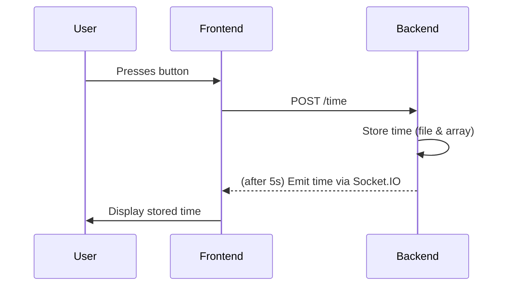

# Show Time AWS V1

## Overview

This project demonstrates a full-stack workflow using React, Express, and Socket.IO. When a user presses a button in the frontend, the backend stores the current time, simulates saving it to DynamoDB, and notifies the frontend after a delay.

---

## Workflow

1. **Frontend (React):**
    - User presses a button.
    - Sends a `POST` request to the Express backend.

2. **Backend (Express):**
    - Receives the request.
    - Stores the current time in a local file (`time.json` or `time.yaml`).
    - Simulates saving the time in DynamoDB (using an in-memory array).
    - Waits 5 seconds, then emits a message to the frontend via Socket.IO.

3. **Frontend (React):**
    - Listens for the Socket.IO event.
    - Displays the stored time when the event is received.

---

## Example Flow

---

## Technologies

- React
- Express
- Socket.IO
- YAML/JSON for local storage
- (Simulated) DynamoDB

---

## Setup

1. Start the backend server.
2. Start the React frontend.
3. Press the button in the UI to trigger the workflow.
